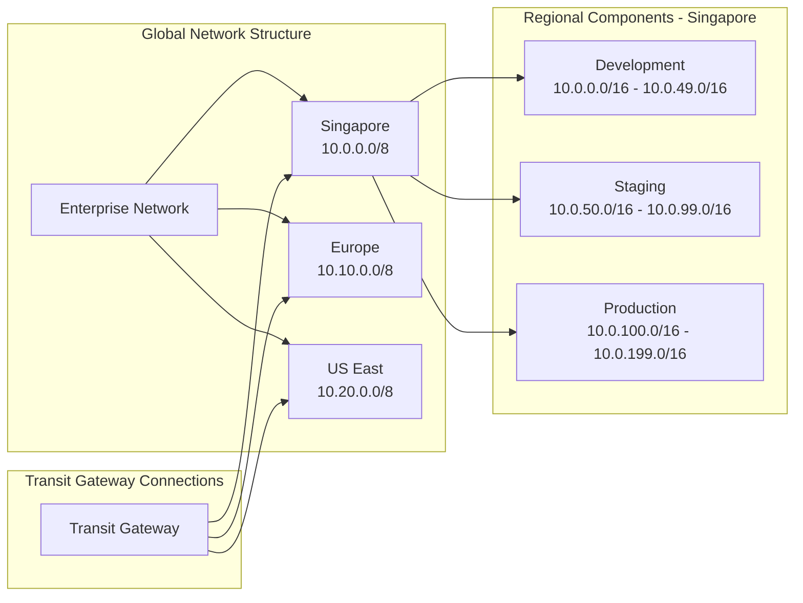

# Global Network Design

```mermaid
graph LR
    subgraph "Global Network Structure"
        E[Enterprise Network] --> SG[Singapore<br>10.0.0.0/8]
        E --> EU[Europe<br>10.10.0.0/8]
        E --> US[US East<br>10.20.0.0/8]
    end

    subgraph "Regional Components - Singapore"
        SG --> DEV[Development<br>10.0.0.0/16 - 10.0.49.0/16]
        SG --> STG[Staging<br>10.0.50.0/16 - 10.0.99.0/16]
        SG --> PROD[Production<br>10.0.100.0/16 - 10.0.199.0/16]
    end

    subgraph "Transit Gateway Connections"
        TG[Transit Gateway] --> SG
        TG --> EU
        TG --> US
    end
```

## Key Components
1. Three main regions using 10.x.x.x range
2. Transit Gateway for connectivity
3. Consistent CIDR allocation

Author: Ditah Kumbong
