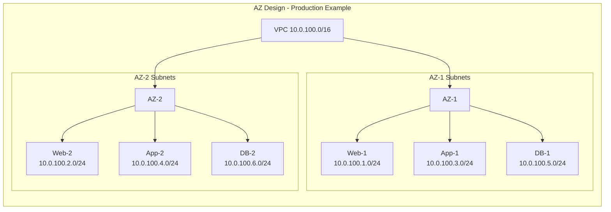

# Availability Zones Design

```mermaid
graph LR
    subgraph "AZ Design - Production Example"
        VPC[VPC 10.0.100.0/16] --> AZ1[AZ-1]
        VPC --> AZ2[AZ-2]

        subgraph "AZ-1 Subnets"
            AZ1 --> WEB1[Web-1<br>10.0.100.1.0/24]
            AZ1 --> APP1[App-1<br>10.0.100.3.0/24]
            AZ1 --> DB1[DB-1<br>10.0.100.5.0/24]
        end

        subgraph "AZ-2 Subnets"
            AZ2 --> WEB2[Web-2<br>10.0.100.2.0/24]
            AZ2 --> APP2[App-2<br>10.0.100.4.0/24]
            AZ2 --> DB2[DB-2<br>10.0.100.6.0/24]
        end
    end
```

## AZ Strategy
1. Active-Active configuration
2. Redundant components
3. Load balancing

Author: Ditah Kumbong
