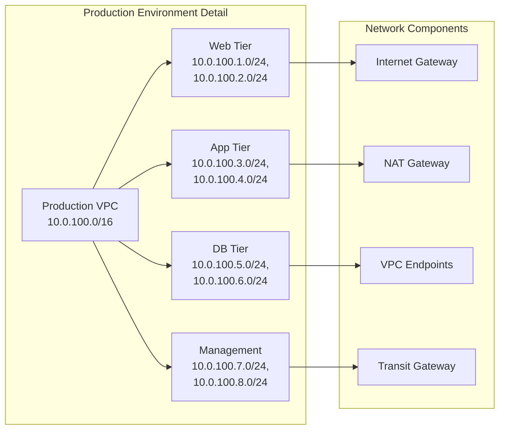

# Regional Network Design

```mermaid
graph LR
    subgraph "Production Environment Detail"
        PROD[Production VPC<br>10.0.100.0/16] --> WEB[Web Tier<br>10.0.100.1.0/24,<br>10.0.100.2.0/24]
        PROD --> APP[App Tier<br>10.0.100.3.0/24,<br>10.0.100.4.0/24]
        PROD --> DB[DB Tier<br>10.0.100.5.0/24,<br>10.0.100.6.0/24]
        PROD --> MGT[Management<br>10.0.100.7.0/24,<br>10.0.100.8.0/24]
    end

    subgraph "Network Components"
        WEB --> IGW[Internet Gateway]
        APP --> NAT[NAT Gateway]
        DB --> EP[VPC Endpoints]
        MGT --> TG[Transit Gateway]
    end
```

## Design Pattern
1. Tier separation
2. CIDR allocation
3. Network components

Author: Ditah Kumbong
