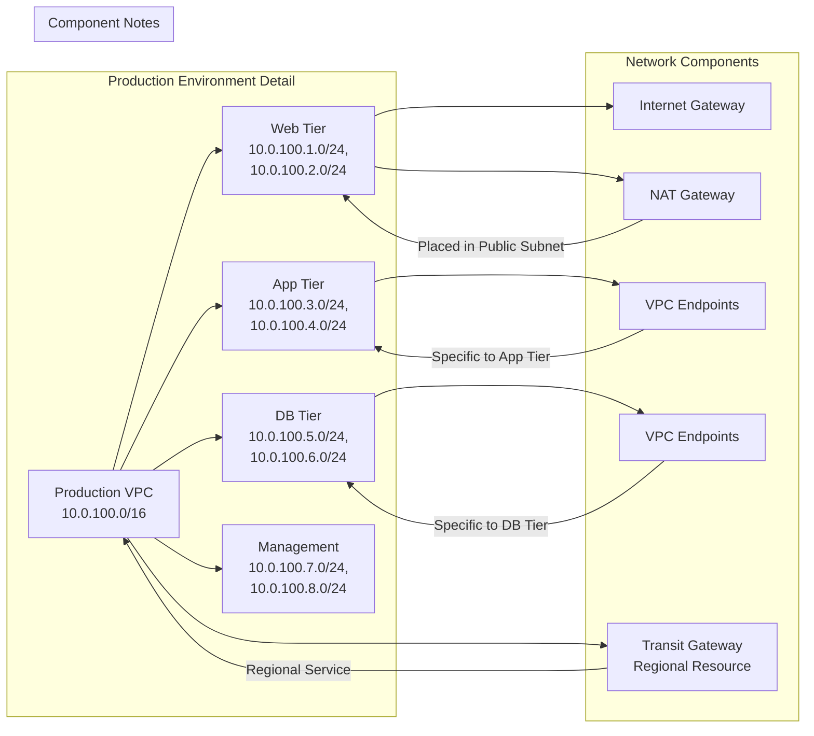

# Regional Network Design

## Design Pattern
1. NAT Gateway in public subnet (Web Tier)
2. VPC Endpoints per private tier as needed
3. Transit Gateway as regional service
4. Clear separation of network components

Author: Ditah Kumbong
